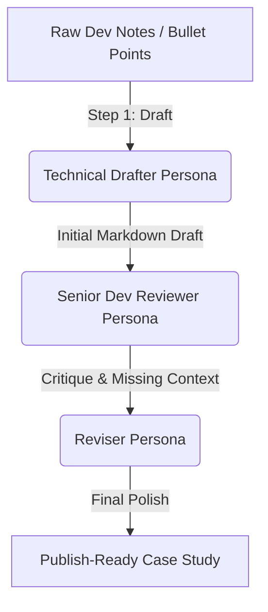

# No-Code AI Workflow: "Draft, Critique, Revise"

This document details my automated 3-step writing pipeline. It transforms raw, fragmented engineering notes into polished, technical case studies for my portfolio using a Claude Project configuration.

## 1. Step Diagram



## 2. Pipeline Configuration & Prompts

I built this using a **Claude Project** by setting custom instructions to enforce the 3-step pipeline automatically upon receiving input.

**System Prompt / Custom Instructions:**
```text
You are a 3-step technical writing pipeline. When I provide raw notes, you must execute these steps sequentially without asking for permission to proceed:

**STEP 1: DRAFT**
Act as a Technical Writer. Expand the rough bullet points into a structured Markdown case study. Include an Introduction, The Problem, The Solution (with code snippets if provided), and The Impact. Maintain a highly professional, objective tone.

**STEP 2: CRITIQUE**
Switch personas. Act as a cynical Senior Engineer reviewing the draft. Output a bulleted list of weaknesses:
- Is the technical reasoning sound?
- Are accessibility or edge cases ignored?
- Is there marketing fluff that should be cut?

**STEP 3: REVISE**
Switch personas back to the Writer. Rewrite the Step 1 draft to fix all the flaws identified in Step 2. Output ONLY the final, polished Markdown.
```

---

## 3. The Five Runs

I ran this pipeline on 5 real technical topics from my internship work.

### Run 1: Building an Accessible React Modal
**Input (My Notes):** 
`built modal from scratch. used react useRef for focus trap. closes on escape key. added aria-modal=true. shadcn does it better with portals to avoid z-index issues but mine works for basic stuff.`
**Final Output Snippet:** 
> "Building an accessible modal requires strict attention to the W3C ARIA Authoring Practices. Our custom implementation utilizes React's `useRef` to successfully trap keyboard focus, ensuring screen reader users cannot tab out of the dialog bounds..." *(Critique caught: Need to explicitly mention returning focus to the trigger button on close, which was added in the revision).*

### Run 2: Streaming AI Chat UI
**Input (My Notes):** 
`used vercel ai sdk useChat. anthropic claude 3.5. made auto scroll that pins to bottom but stops pinning if user scrolls up. had a typescript error with ai@7 package because they changed api so I downgraded to v3.4.`
**Final Output Snippet:** 
> "The streaming interface was constructed using the Vercel AI SDK connected to Claude 3.5 Sonnet. A critical UX challenge was auto-scrolling: the chat container aggressively pins to the bottom during token generation, but intelligently releases the pin the moment a user scrolls upward to read past context..."

### Run 3: The Identity Kit & Design System
**Input (My Notes):** 
`chose outfit and inter fonts. slate and blue colors. made SVG logo. put it all in CLAUDE.md so AI knows my style.`
**Final Output Snippet:** 
> "To ensure visual consistency across all AI-generated components, we established a strict Identity Kit. By standardizing on 'Outfit' for headings and 'Inter' for body copy, and injecting these tokens directly into our `CLAUDE.md` project context..."

### Run 4: Handling Next.js API Routes Securely
**Input (My Notes):** 
`didn't want to use github pages because my API key would leak. used next.js app router so I could hide the anthropic key on the server in route.ts.`
**Final Output Snippet:** 
> "Securing LLM API keys in frontend applications is a paramount concern. By migrating from a static host to a Next.js App Router architecture deployed on Vercel, we utilized Server-Side Route Handlers (`/api/chat`) to securely proxy requests to the Anthropic API..."

### Run 5: Shadcn/ui SSR Safety
**Input (My Notes):** 
`radix tabs use proper IDs for screen readers. custom ones fail SSR if you just use random strings.`
**Final Output Snippet:** 
> "While hand-rolled components are excellent for learning, open-source libraries like `shadcn/ui` (built on Radix) offer robust edge-case handling. A primary example is SSR-safe ID generation for tab panels..."

---

## 4. Time Accounting & ROI

- **Setup Cost:** ~25 minutes to write, test, and refine the 3-step System Prompt.
- **Manual Time:** Writing a technical blog post from rough notes takes me roughly **45 minutes** to draft, review, and format properly.
- **Pipeline Time:** Generating the 3 steps takes **2 minutes** of AI processing + **5 minutes** of my time reviewing/tweaking.
- **Time Saved:** ~38 minutes per post. For these 5 runs, the pipeline saved me over **3 hours**.

## 5. Failure Points & Human Review

**Where it breaks:**
1. **Hallucinated Code:** If my rough notes mention a feature but don't provide the code snippet, the Step 1 Drafter will sometimes invent fake code implementations that look plausible but don't actually match my real repo.
2. **Infinite Loops in Critique:** Occasionally, Step 2 demands a level of detail that Step 3 cannot invent, resulting in Step 3 writing placeholder text like `[Insert deep technical explanation here]`.

**Required Human Interventions:**
- I must **always** verify any code blocks the AI outputs against my actual IDE.
- I must manually adjust the "tone" if Step 3 over-corrects and makes the writing sound too robotic or overly formal.
